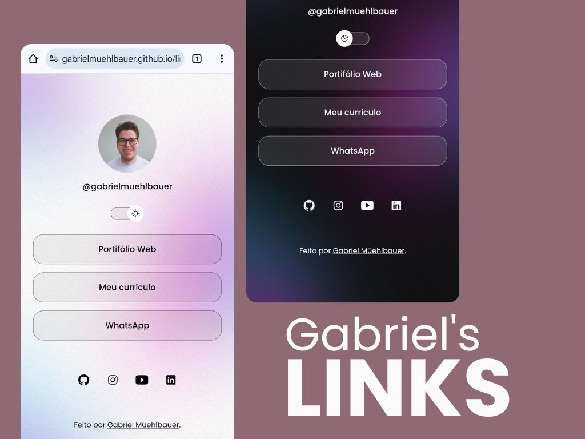

<h1 align=center>Gabriel's Links</h1>

Um programa criado por Gabriel Müehlbauer no curso Discover da Rocketseat.

<h2>🎯 Objetivo</h2>

O projeto deve agrupar links em uma página na web para usar como cartão de visitas online. Semelhante ao Linktree.

<h2>🧰 Tecnologias</h2>

<ul>
  <li>HTML5</li>
  <li>CSS3</li>
  <li>JavaScript</li>
  <li>Ionicons</li>
  <li>VSCode</li>
  <li>Git e Github</li>
</ul>

<h2>🧠 Aprendizados</h2>

Neste projeto tive muitos aprendizados relacionados principalmente ao Front end, alguns conceitos de CSS se tornaram mais claros, principalmente sobre posicionamento de itens e texto, além disso aprendi como implementar o modo escuro e também como é importante a criação de variáveis no CSS.

